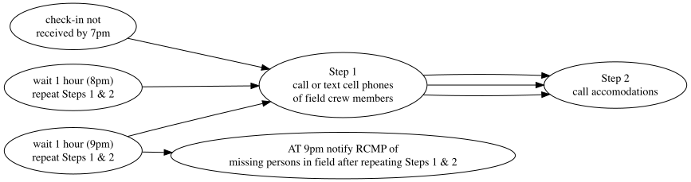

{.logo} 


 

<br>

::: from
Al Irvine  
New Graph Environment Ltd.  
al@newgraphenvironment   
250-777-1518  
Date Original: 2025-07-16  
Date Revised: `r format(Sys.Date(), "%Y-%m-%d")` 
:::


<br>


```{r setup, include = TRUE, echo =FALSE, message=FALSE, warning=FALSE}
# gitbook_on <- TRUE
gitbook_on <- FALSE  ##we just need turn  this on and off to switch between gitbook and pdf via paged.js


knitr::opts_chunk$set(echo=FALSE, message=FALSE, warning=FALSE, dpi=60, out.width = "100%")
options(scipen=999)
options(knitr.kable.NA = '--') #'--'
options(knitr.kable.NAN = '--')

source('scripts/packages.R')
source('scripts/staticimports.R')

# use the repo_url to extract the project region and year
project_region <- stringr::str_extract(params$repo_url, "(?<=safety_plan_)[^_]+")
project_year <- stringr::str_match(params$repo_url, "safety_plan_[^_]+_([0-9]{4})")[,2]

# This varies depending on the date the file was created
gis_planning_file <- "planning_20250703.gpkg"

# Create links
link_kml <- paste0(params$repo_url, '/raw/main/docs/sites_', project_region, '_', project_year, '_', format(Sys.Date(), '%Y%m%d'), '_kml_gpx.zip')
link_pdf <- paste0(params$repo_url, '/blob/main/docs/safety_plan_sern_', project_region, '_', project_year, '.pdf')
# We only have maps for parsnip
link_fieldmaps <- 'https://hillcrestgeo.ca/outgoing/fishpassage/projects/parsnip/'

## NEED TO UPDATE ACCOMODATIONS
hotel1 <- "3396 Rosia Road, Prince George, BC V2K 4Y5"
hotel2 <- "3990 Larisa Court, Prince George, BC V2K 0B1"

vehicle1 <- '2013 Toyota Tundra black w/flatdeck and yellow can-am quad'
vehicle2 <- '2006 Pontiac Vibe red'
```


```{r info-hospitals}
hospital_name <- 'University Hospital of Northern British Columbia'
hospital_phone <- '250-565-2000'
hospital_address <- '1475 Edmonton St., Prince George, BC V2M 1S2'

```

```{r import-projects}
####--------------bring in the equipment list and crew info-----------------
projects <-  readxl::excel_sheets(path = "../onboarding/data/equipment_contacts_safetylog.xlsx") %>% 
  purrr::set_names() %>% 
  purrr::map(readxl::read_excel,
             path = "../onboarding/data/equipment_contacts_safetylog.xlsx",
             .name_repair = janitor::make_clean_names) %>% 
  purrr::set_names(janitor::make_clean_names(names(.))) %>% 
  purrr::map(fpr::fpr_sheet_trim) |>  #this is the clean run of this function at_trim_xlsheet
  purrr::map(plyr::colwise(type.convert))


```


```{r settings-gitbook, eval= gitbook_on}
photo_width <- "100%"
font_set <- 11

```

```{r settings-paged-html, eval= identical(gitbook_on, FALSE)}
photo_width <- "80%"
font_set <- 8
```


<br>

# `r paste0('Safety Plan - ', params$job_name)` {.unnumbered .break-after-me}

The latest version of this pdf can be downloaded [here](`r knitr::asis_output(link_pdf)`).

<br>

This project has two primary goals. The first is to conduct fish passage (Phase 1) and habitat confirmation (Phase 2) assessments within the Nation River watershed group. The second goal is to implement baseline monitoring at previously assessed and/or remediated crossings in the Parsnip, Crooked, and Carp River watershed groups. Fieldwork will include electrofishing at permitted sites and collection of environmental DNA (eDNA) samples. 

<br>

Field activities will be completed with support from crews from McLeod Lake Indian Band and other partner organizations. A summary of potential sites for fish passage assessments, habitat confirmation assessments, and electrofishing is provided in Table \@ref(tab:tab-electrofishing-sites) and Figure \@ref(fig:map-prep). Google Earth (KML) and Garmin (GPX) files for the proposed sites are available for download [here](`r knitr::asis_output(link_kml)`). Georeferenced pdf maps for select watershed groups can be accessed and downloaded [here](`r knitr::asis_output(link_fieldmaps)`).

<br>

## New Graph Environment Employee Information {.unnumbered}

Al Irvine  
Vehicle:  `r vehicle1`  
Accommodation: `r hotel1`  

<br>

Lucy Schick     
Vehicle:  `r vehicle2`  
Accommodation: `r hotel2  `


<br>

## Crew Members {.unnumbered}

New Graph Employees Al Irvine and Lucy Schick will be joined by crews from McLeod Lake Indian Band. All crew member information and emergency contacts can be found below.

<br>

```{r tab-crew}
crew_ids <- c('airvine', 
              'lschick', 
              'jisadore',
              # 'tsalonas',
              'bprince',
              'jdemont')

tab_crew <- projects |>  
  purrr::pluck('crew_contacts') |>  
  dplyr::filter(id %in% crew_ids) |>  
  dplyr::select(-id) %>%   
  purrr::set_names(nm = names(.) |> stringr::str_replace_all('crew_', ''))

tab_crew |>  
  knitr::kable(caption = 'Crew members details and emergency contacts', label = NA) |>  
  kableExtra::kable_styling(c("condensed", "responsive"),
                            full_width = TRUE,
                            font_size = font_set)
```

<br>

## Equipment Checklists {.unnumbered}

PLEASE NOTE THAT EQUIPMENT CHECKLISTS ARE PROVIDED FOR THE OVERALL TEAM AND NOT ALL CREWS ARE REQUIRED TO HAVE ALL EQUIPMENT.  ALTHOUGH ENCOURAGED FOR ALL ENVIRONMENTAL SCIENCE TECHNICIANS AND MONITORS TO HAVE THE PERSONAL EQUIPMENT NEW GRAPH ENVIRONMENT WILL HAVE ALL EQUIPMENT NECESSARY TO COMPLETE THE WORK.  

<br>


MINIMUM REQUIREMENTS FOR EACH CREW MEMBER INCLUDES GOOD QUALITY AND APPROPRIATELY FITTING LIGHT WEIGHT WADERS AND SEPERATE WADING BOOTS (RUBBER SOLED), HAT, WATER AND A FOOD.  

<br>


MINIMUM REQUIREMENTS FOR FIELD TRUCKS INCLUDE A QUALITY RADIO APPROPRIATE FOR FOREST SERVICE ROADS, OFF-ROAD CAPABLE TIRES IN GOOD CONDITION, SPARE TIRE, JACK, AND TOOLS.

<br>
<br>
<br>


```{r table-equipment, eval=TRUE}
eq <- readr::read_csv("~/Projects/repo/onboarding/data/equipment.csv")

## personal equipment
tab_eq_pers <- eq |>
  dplyr::filter(!is.na(eq_pers_standard)) |>
  dplyr::arrange(eq_safety) |>  ## have these first on the list
  dplyr::select(Equipment = eq_item) |> 
  my_untidy_table_2(n_cols = 4)

my_caption <- 'Personal Equipment Checklist - SEE NOTE ABOVE FOR MINIMUM REQUIREMENTS'

tab_eq_pers |>
  knitr::kable(caption = my_caption, label = NA) |>
  kableExtra::kable_styling(
    bootstrap_options = c("condensed", "responsive"),
    full_width = TRUE,
    font_size = font_set
  )


```

<br>

```{r equip-crew}

##equipment for the crew
tab_eq_crew <- eq |>
  dplyr::filter(if_any(dplyr::starts_with('eq_task'), ~ . %in% c("fish passage", "uav", "electrofishing"))) |>
  dplyr::filter(is.na(eq_pers_standard)) |>
  # dplyr::arrange(eq_safety) |>
  dplyr::select(`Crew Equipment Checklist` = eq_item) |>
  my_untidy_table_2(n_cols = 4)

my_caption <- 'Crew Equipment Checklist - SEE NOTE ABOVE FOR MINIMUM REQUIREMENTS'

tab_eq_crew |>
  knitr::kable(caption = my_caption, label = NA) |>
  kableExtra::kable_styling(
    bootstrap_options = c("condensed", "responsive"),
    full_width = TRUE,
    font_size = font_set
  )

```

<br>

```{r equip-edna}

##equipment for the crew
tab_eq_edna <- eq |>
  dplyr::filter(if_any(dplyr::starts_with('eq_task'), ~ . == "edna")) |> 
  dplyr::select(`eDNA Equipment Checklist` = eq_item ) |>
  my_untidy_table_2(n_cols = 4)

my_caption <- 'eDNA Equipment Checklist - SEE NOTE ABOVE FOR MINIMUM REQUIREMENTS'

tab_eq_edna |>
  knitr::kable(caption = my_caption, label = NA) |>
  kableExtra::kable_styling(
    bootstrap_options = c("condensed", "responsive"),
    full_width = TRUE,
    font_size = font_set
  )

```

<br>

```{r equip-cabin}

##equipment for the crew
tab_eq_cabin <- eq |>
  dplyr::filter(if_any(dplyr::starts_with('eq_task'), ~ . == "cabin")) |> 
  dplyr::select(`CABIN Equipment Checklist` = eq_item ) |>
  my_untidy_table_2(n_cols = 4)

my_caption <- 'CABIN Equipment Checklist - SEE NOTE ABOVE FOR MINIMUM REQUIREMENTS'

tab_eq_cabin |>
  knitr::kable(caption = my_caption, label = NA) |>
  kableExtra::kable_styling(
    bootstrap_options = c("condensed", "responsive"),
    full_width = TRUE,
    font_size = font_set
  )

```

<br>

```{r equip-truck}

my_caption <- 'Truck Equipment Checklist - SEE NOTE ABOVE FOR MINIMUM REQUIREMENTS'

## equipment for the crew
eq |> 
  dplyr::filter(eq_truck == 'x') |>  
  dplyr::filter(is.na(eq_pers_standard)) |>  
  dplyr::arrange(eq_safety) |>  
  dplyr::select(Equipment = eq_item) |> 
  my_untidy_table_2(n_cols = 4) |> 
  knitr::kable(caption = my_caption, label = NA) |> 
  kableExtra::kable_styling(
  bootstrap_options = c("condensed", "responsive"),
  full_width = TRUE,
  font_size = font_set
)

```

<br>

## Nearest Hospitals {.unnumbered}

```{r hospital-1, fig.cap=my_caption, fig.width=6, eval=TRUE}
my_caption = paste(hospital_name, hospital_address, hospital_phone, sep = ' - ')

##register google key defined in 'R/private_info.R' file
ggmap::register_google(key = Sys.getenv('GOOG_API_KEY'))

#define the area of the base map by using a bounding box 
mybasemap <- ggmap::get_map(location = hospital_address,
                     source = "google",
                     zoom = 16,
                    maptype = "roadmap")  

# Extract the center coordinates from the map object
center_lon <- attr(mybasemap, "bb")$ll.lon + (attr(mybasemap, "bb")$ur.lon - attr(mybasemap, "bb")$ll.lon) / 2
center_lat <- attr(mybasemap, "bb")$ll.lat + (attr(mybasemap, "bb")$ur.lat - attr(mybasemap, "bb")$ll.lat) / 2

# Plot the map with the hospital symbol at the center
ggmap::ggmap(mybasemap) +
  geom_text(aes(x = center_lon, y = center_lat), 
            label = "H", 
            size = 10, 
            colour = "red", 
            fontface = "bold")


```

<br>

## Emergency Response Plan {.unnumbered}

New Graph Environment's detailed emergency response procedures can be found [here](https://www.newgraphenvironment.com/hsp/plans-and-assessments.html#emergency-response-plan-erp-and-procedures). These procedures should be reviewed and an emergency response plan should be completed for each job site. Our Emergency Responce Plan template can be downloaded [here](https://github.com/NewGraphEnvironment/hsp/blob/master/data/form_templates/ERP_template.pdf).

<br>

## Driving {.unnumbered}

We will be driving on forest service roads where it is essential to exercise caution and adhere strictly to all radio use protocols to ensure our safety. Proper communication on these roads helps prevent accidents by keeping everyone informed about vehicle movements and road conditions. Please review the [resource road safety](https://www.newgraphenvironment.com/hsp/safe-work-procedures-and-practices.html#resource-road-safety) and [radio use](https://www.newgraphenvironment.com/hsp/safe-work-procedures-and-practices.html#radio-use) sections of our Health and Safety plan so that everyone stays safe. 

<br>

## Field Plan {.unnumbered}

Fieldwork will focus on baseline monitoring in the Parsnip, Crooked, and Carp River watershed groups, and fish passage (Phase 1) and habitat confirmation (Phase 2) assessments in the Nation River watershed group. Activities will include electrofishing at permitted sites and the collection of environmental DNA (eDNA) samples. Crews from McLeod Lake Indian Band and other partners will support the fieldwork. 

<br>

Fieldwork methods will result in products feeding reporting formats such as our [2024](https://www.newgraphenvironment.com/fish_passage_peace_2024_reporting/) and [2023](https://www.newgraphenvironment.com/fish_passage_peace_2023_reporting/) reports. We generally follow procedures in:

-   [fish passage assessments](https://www2.gov.bc.ca/assets/gov/environment/natural-resource-stewardship/land-based-investment/forests-for-tomorrow/field-assessment-for-determining-fish-passage-status-of-cbs.pdf) [@ministryofenvironment2011Fieldassessment]

-   [habitat confirmations](https://www2.gov.bc.ca/assets/gov/environment/natural-resource-stewardship/land-based-investment/forests-for-tomorrow/checklist-for-fish-habitat-confirmation-201112.pdf) [@confirmation_checklist_2011].

<br>

Information on fish presence/absence, species composition, density, and distribution limits is useful for prioritizing crossings for fish passage restoration and informing follow-up monitoring. To support this, electrofishing, minnow trapping, and eDNA sampling may be conducted where appropriate. Standard Fish and Fish Habitat Inventory Field Forms ([site cards](https://www2.gov.bc.ca/gov/content/environment/natural-resource-stewardship/laws-policies-standards-guidance/inventory-standards/aquatic-ecosystems)) are used to collect habitat data. The field guide for completing these forms is available [here](https://www2.gov.bc.ca/assets/gov/environment/natural-resource-stewardship/nr-laws-policy/risc/sitecard20.pdf).

<br>

Passive Integrated Transponder (PIT) tagging equipment is available and may be used to mark fish captured at electrofishing sites. Tagging can support long-term monitoring by providing data on population size and fish movement upstream and downstream of crossings. An overview of the tagging process is available [here](https://www.youtube.com/watch?v=9CKZ9yaS5o8). To anesthetize fish prior to PIT tagging, we use a clove oil solution at 0.1mL/L (1:10,000), which provides effective sedation with minimal residual effects [@fernandes_etal2017efficacyclove]. The solution is prepared by dissolving clove oil in ethyl alcohol at a 1:9 ratio before mixing into water [@fernandes_etal2017efficacyclove].

<br>

Digital field forms are used to collected data, utilizing [Mergin Maps](https://merginmaps.com/?gclid=Cj0KCQjwxb2XBhDBARIsAOjDZ34oq-iMid3vRrgK1ZAkJ_yiz4aWY-LLF90PHiXzELbZIrxooV9vWKYaAgl2EALw_wcB), which syncs with QGIS and supports offline use. Instructions for setting up Mergin Maps and using the digital field forms can be found in the [Fish Passage Guidebook](https://www.newgraphenvironment.com/fish_passage_guidebook/). Users should send their Mergin usernames to enable project sharing and form access.

<br>

A field guide to freshwater fish identification, such as *Field Key to the Freshwater Fishes of British Columbia* by @mcphail_carveth1993FieldKey, can be useful during fieldwork. It is available for download [here](https://a100.gov.bc.ca/pub/acat/documents/r13659/486FieldKeytoFreshwaterFishes1993Part1of2_1210014849226_8e248a8d30d97e6c45ef54a340babd2ffb57b14a3b16.pdf).

<br>

### Check In Procedures {-}

Call, text, or InReach Tara Stark (2505059854) each morning to share the plan for the day (i.e. name of roads and sites). Check in time is before 7pm each evening although we regularly check in throughout the day (ex. at arrival to site, 1pm and 4pm) on the InReach or by text and report position/provide updates.

<br>

#### Procedures for Failed Check-In - for Check in person {-}

Procedures are summarized in Figure \@ref(fig:flow-check-in-fail). If phone call or InReach check-in is not received by 7pm send text to InReach units, call or text cell phones of field crew members. If no response please call accommodations then personal emergency contacts to see if they have heard anything. Wait 1 hour and text InReach, text or call cell phones and personal emergency contacts and accommodations again. Repeat after 2 hours (9 pm) - if no response then notify the RCMP of a missing persons in field.

<br>

```{r flow-check-in-fail, fig.cap= 'Procedures for failed check-in', eval=T}
#  Not sure why this doesn't work yet
DiagrammeR::grViz("digraph rmarkdown{
  
graph[layout = dot, rankdir = LR]

d1 [label = 'check-in not \n received by 7pm']
d2 [label = 'Step 1 \n call or text cell phones \n of field crew members']
d3 [label = 'Step 2 \n call accomodations']
d4 [label = 'wait 1 hour (8pm) \n repeat Steps 1 & 2']
d5 [label = 'wait 1 hour (9pm) \n repeat Steps 1 & 2']
d6 [label = 'AT 9pm notify RCMP of \n missing persons in field after repeating Steps 1 & 2']


d1 -> d2 -> d3 
d4 -> d2 -> d3 
d5 -> d2 -> d3 
d5 -> d6
}") |>  
  DiagrammeRsvg::export_svg() %>%
  charToRaw %>% 
  rsvg::rsvg_png("fig/flow-check-in-fail.png")
  
  


```

`r if(gitbook_on){knitr::asis_output("<br>")} else knitr::asis_output("<br><br><br>")`


```{r load-sites-csv, results='hide', eval = T}

#move the csv files containing all the sites we plan to visit to this repo, this file was made in the permit repo, so no need to do the work again.
name_sites_csv <- paste0("sites_", project_region, "_", project_year, ".csv")
path_from <- paste0("~/Projects/repo/fish_passage_", project_region, "_", project_year, "_permit/data/", name_sites_csv)

fs::file_copy(path_from,
              "data/",
              overwrite = T)


#read in the csv
table_sites <- readr::read_csv(paste0("data/", name_sites_csv)) |> 
  fpr::fpr_sp_assign_sf_from_utm(col_easting = "utm_easting",
                                 col_northing = "utm_northing",
                                 crs_return = 4326)
  # dplyr::select(id,
  #               stream_name,
  #               utm_zone,
  #               utm_easting,
  #               utm_northing,
  #               bt_network_km,
  #               bt_spawning_km,
  #               bt_rearing_km,
  #               watershed_group_code,
  #               pscis_assessment_comment,
  #               my_priority,
  #               my_priority_comments)

```

```{r load-bcfishpass, eval = F}

# Use if we need to pull our potential sites from bcfishpass.

conn <- fpr::fpr_db_conn()

ids <- c(
  #arctic
  125000, 
  #fern
  125261, 
  # table 21k
  125231,
  #missinka remediated
  125179,
  ##missinka reference
  125180,
  ##trib to Kerry Lake where BCTS is deactivating.  Good flow
  198692,
  ##trib to McLeod with large outlet, ok flow and decent looking habitat. On reserve and close to community
  198668,
  ##trib to McLeod Lake right at the store and walking distance from community.  
  ## good site for sampling to get people interested
  #large outlet drop, ok flow and decent looking habitat. On reserve
  198667
  )

# grab the crossings data 
table_sites <- fpr::fpr_db_query(
  glue::glue_sql("SELECT * FROM bcfishpass.crossings_vw WHERE stream_crossing_id IN ({ids*})", .con = conn)) |> 
  select(id = stream_crossing_id, stream_name = pscis_stream_name, gnis_stream_name, utm_zone, utm_easting, utm_northing, bt_network_km, bt_spawning_km, bt_rearing_km, watershed_group_code, pscis_assessment_comment
         ) |>
  dplyr::mutate(dplyr::across(dplyr::starts_with('bt_'), ~round(., 1))) |> 
  mutate(stream_name = case_when(
    is.na(stream_name) ~ gnis_stream_name,
    T ~ stream_name
  )) |> 
  select(-gnis_stream_name) |> 
  sf::st_transform(crs = 4326) |> 
  fpr::fpr_sp_assign_latlong(col_lon = "long") |> 
  arrange(id)
```

```{r gpx-kml-clean}
# because we rebuild everytime we need to remove the old files so we don't
# zip up old files

##identify the old zip
fs::file_delete(
  fs::dir_ls(path = "docs", glob = "*.zip")
)


fs::file_delete(
  fs::dir_ls(path = "mapping", glob = "*.gpx|*.kml")
)
```


```{r gpx, eval = T}

dir.create('mapping')
path_gps <- paste0("mapping/sites_", project_region,"_", project_year, '_', format(Sys.Date(), "%Y%m%d"), ".gpx")

#make a gpx file for loading into the gps'
table_sites |> 
  dplyr::mutate(desc = paste0("bt_rearing - ", bt_rearing_km, "km. ", my_priority_comments),
         # make a name that tells a story so we see it on the gps
         name = paste0(id, " - ", my_priority)) |> 
  dplyr::distinct(id, .keep_all = T) |>
  dplyr::rename(geometry = geom) |> 
  dplyr::select(name, desc, geometry) |> 
  sf::st_transform(crs = 4326) |> 
  sf::write_sf(dsn = path_gps, driver="GPX",
           dataset_options="GPX_USE_EXTENSIONS=yes", delete_dsn = TRUE)

```

```{r kml, eval = T}
##make a kml for adding to the georef pdf and sharing with stakeholders

table_sites |> 
  dplyr::mutate(name = paste0(id, " - ", my_priority)) |> 
    # dplyr::mutate(name = paste0(id, " - ", my_priority, " - MoTi_ID = ", moti_chris_culvert_id)) |> 
  sf::st_write(dsn = paste0("mapping/sites_", project_region,"_", project_year, '_', format(Sys.Date(), "%Y%m%d"), ".kml"), delete_dsn = TRUE, quiet = TRUE)


##now we will zip up the kml files in the data folder and rename with kmz
files_to_zip <- fs::dir_ls(path = "mapping", glob = "*.kml|*.gpx")

zip::zipr(paste0("docs/sites_", project_region, "_", project_year, '_', format(Sys.Date(), "%Y%m%d"), '_kml_gpx.zip'), files = files_to_zip)  ##it does not work to zip to kmz!!


```

<!-- `r if(gitbook_on){knitr::asis_output("<br>")} else knitr::asis_output("<br><br><br><br><br><br><br>")` -->

```{r map-prep, fig.cap=my_caption, eval=TRUE}

my_caption = 'Map of potential sampling areas.'

# set a buffer for the area of interest
aoi_buffer <- 0.01

##register google key defined in 'R/private_info.R' file
ggmap::register_google(key = Sys.getenv('GOOG_API_KEY'))

#define the area of the base map by using a bounding box 
mybasemap <- ggmap::get_map(
  location = c(left = table_sites |> pull(long) |> min()-aoi_buffer, 
               bottom = table_sites |> pull(lat) |> min()-aoi_buffer,
               right = table_sites |> pull(long) |> max()+aoi_buffer,
               top = table_sites |> pull(lat) |> max()+aoi_buffer),
  source = "google",
  zoom = 9,
  maptype = "roadmap")


mymap <- ggmap::ggmap(mybasemap) + 
  geom_point(data = table_sites , 
             aes(x = long, y = lat,
                 color = 'red'),
             show.legend = F) +

  ggrepel::geom_label_repel(
    # wrangle for more informative "label" but not used as too much detail for map
    data = table_sites |> 
               dplyr::mutate(label = paste(id, stream_name, sep = " - ")),
                            aes(x = long, y = lat, label = id),
                                box.padding = 0.5, 
                            point.padding = 0.1,
                            max.overlaps = 30,
               size = 2.5
                            ) 

mymap


```

<br>


```{r tab-electrofishing-sites}

# make table with all the sites that we may do phase 1 assessments, phase 2 assessments, and/or fish sampling.

table_sites |>  
  sf::st_drop_geometry() |> 
  dplyr::arrange(id) |>  
  dplyr::select(id,
                stream_name,
                utm_zone:utm_northing,
                watershed_group_code,
                pscis_assessment_comment) |> 
  knitr::kable(caption = 'Potential Phase 1 assessment, Phase 2 assessment, and Electrofishing Locations',  label = NA) |>  
  kableExtra::kable_styling(c("condensed", "responsive"),
                              full_width = T,
                              font_size = font_set)
```

<br>

# References {.unnumbered}

