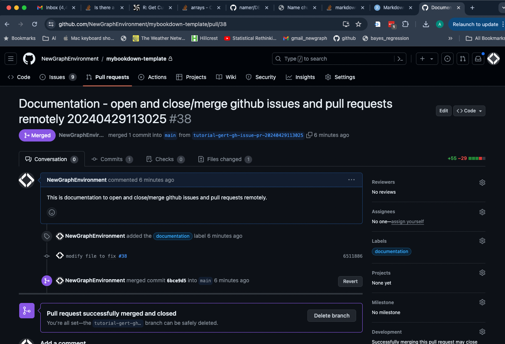

```{r setup, eval = TRUE}
knitr::opts_chunk$set(
  echo=TRUE, 
  include = TRUE,
  message=FALSE, 
  warning=FALSE, 
  dpi=60, 
  out.width = "100%", 
  # note the use of a param here! We only want to run the script once so we will turn this off after we do that.
  eval = params$evaluate)
options(scipen=999)
options(knitr.kable.NA = '--')
options(knitr.kable.NAN = '--')
```

# Introduction

Wanted to learn how to do this for a while so may as well document the process. A few things to note:

  1. This documentation assumes this script is run by the repository owner. Otherwise (I think) - the PR will not be able to be merged.  Credentials were set up with the credential store via `gh` and `gert` as per the package documentation.
  2. The process run with the rendering of this script opens an issue and then transfers it to a pull request (PR). Under the hood PRs are actually issues.  To see the issue after it is closed we need to clear the search window in github/issues.
  3. we are doing this in a Rstudio project so we can use `gert` to interact with the git repo that we are in without specifying the path to the repo.
  4.  We are running this from the `main` `git` branch. When a build of this`html` document fails we need to `checkout` back to our main branch and should delete the branch we create with the script.
  5.  there are `params` defined that allow us to replicate this with different runs and in different repos with or without actually running the code during file rendering.
  6. This is of course just one of many options for this type of workflow and far from finalized as a standard operating procedure.  For example, we can merge new branches locally with tools like `gert` without pushing to github first.  
  7. Although we could name  both the output file (`file_output`) and the branch iteratively without `params` - using `knitr::current_input()` (https://stackoverflow.com/questions/30153194/access-name-of-rmd-file-and-use-in-r) - based on the name of this `.Rmd` file:

    branch_name <- paste0(
    tools::file_path_sans_ext(knitr::current_input()), 
    params$run_number
    )

  that would put us in a position that we cannot run this script one chunk at a time. For that reason we have named the `file_in` and the `basename` for the branch in `params` for now.
  
  8. This type of workflow can cause headaches but we will experiment as it may help ease some logistical hurdles/burdens that we have been facing related to documentation of workflows.  
  9. For some reason - *sometimes* - after running part or all of this script - when we attempt to clear our global environment by restarting R - we get an error that `Rstudio Session Disconnected` and we are booted out of our project. We may want to try restarting Rstudio to clear env instead. Inconsistent at this point though... Not sure why.
  10. Currently - this script deletes the created branch locally after a PR and merge is done. This leaves the branches present
  remotely. We may want to add a step to delete the branch remotely as well.  
  11.  We cannot commit the `.html` output of these files at the same time as we run the script because it is not made yet! Took me a while to figure that out. Ha.
  


# Name the Output File that Documents this Process

This is the output `html` file name setup and assumes we use the same name and directory for the html output file as the Rmd input file. **This is the only chunk we are currently running manually - except the last chunk which is copied and pasted into the console.**

```{r name-output}
# This assumes we use the same name and directory for the html output file as the Rmd input file
file_out <- paste0(
  basename(
    tools::file_path_sans_ext(params$file_in)
  ), 
  '.html'
)
```

# Make and Issue and Add a Label

Make an issue in our repo and capture the output returned from the request as `output_issue_create`.

```{r post1}

# the title and body of this could be added iteratively based on the `metadaata` of the `Rmd` file but that would have us reliant on knitr in action and not able to run this script one chunk at a time.
output_issue_create <- gh::gh(
  endpoint = "POST /repos/{owner}/{repo}/issues",
  title = paste0(
    params$issue_title, params$run_number),
  body = params$issue_body,
  owner = params$repo_owner,
  repo = params$repo_name
)

```

<br>

Add a label or list of labels to the repo by referencing the issue number grabbed from the captured output of the request that made the issue.

<br>

**Note** - Apparently, if we want to add only one label (vs multiple lables) we can't just pass a single string to `labels` - because it fails and complains it wants an `array`. So - b/c in this case we want to just add one label - we will make that string an array.

```{r post2}
# add them to the repo
gh::gh(
  endpoint = "POST /repos/{owner}/{repo}/issues/{issue_number}/labels",
  owner = params$repo_owner,
  repo = params$repo_name,
  issue_number = output_issue_create$number,
  labels = as.array("documentation")
)

```

# Create a Branch, Add a File, Commit, Push

Next let's test using `gert` to create a new branch, add a file, commit it, and push it to the repo. Then we will do a pull request (PR) and close the issue with the commit message.

1.  Create a new branch with a unique name and switch to it.  

```{r git010}
branch_name <- paste0(params$branch_name, params$run_number)

gert::git_branch_create(branch_name) 

```

<br>

3.  Add and commit these files to the repo and push to `github` in the branch we just created. Our commit message *should* close the issue with the commit message once the PR is merged.

```{r git020}
# add in and out files - can't commit the .html bc it is not rendered yet!
# gert::git_add(
#   c(params$file_in, 
#     paste0(dirname(params$file_in), "/", file_out))
# )

gert::git_add(params$file_in)

gert::git_commit(
  paste0(
    "modify file to fix #", 
    output_issue_create$number))

gert::git_push()

```

# Create a Pull Request

Create a PR to ask to merge this branch into `main` and reference the issue number in the PR body so we get the `title`, `body`, and `comments` of our original issue within the new pull request!! Wow. <https://docs.github.com/en/rest/pulls/pulls?apiVersion=2022-11-28#create-a-pull-request>

<br>

Capture the output returned from the request as `output_pr`.

```{r git030}
output_pr <- gh::gh(
  endpoint = "POST /repos/{owner}/{repo}/pulls",
  owner = params$repo_owner,
  repo = params$repo_name,
  issue = output_issue_create$number,
  head = branch_name,
  base = "main"
)

```

# Merge the Pull Request

Now let's go ahead and merge the pull request referencing our output PR number (`output_pr$number`) and referenceing the issue number. Not sure what benefit we get from referencing the issue because the PR is actually made of the issue and it should close due to the earlier commit message.

```{r git040}
gh::gh(
  endpoint = "PUT /repos/{owner}/{repo}/pulls/{pull_number}/merge",
  owner = params$repo_owner,
  repo = params$repo_name,
  pull_number = output_pr$number,
  commit_title = paste0("adresses #", output_issue_create$number)
)

```

<br>

# Switch Back to Main Branch, Delete the PR Branch and Pull the Main Branch back from Github

```{r git050}
gert::git_branch_checkout("main")
gert::git_branch_delete(branch_name)
gert::git_pull()

```


Here is a little bit of trickery to help tell this story. We want to add a screenshot of what we have done but it is not done yet. To get around that we will do this twice and include the screenshot from the first time we ran this script in the output of the second. This is a bit of a hack but it will work.

```{r fig1}

```

# Rendering

Banger. We are done. In order to render this document to html, we need to run the following code IN THE CONSOLE with the `file_in` and `file_out` objects present in our `global environment` (ie. we see them in the `environment` window in `Rstudio`). To do that we only need to run the `name-output` chunk of this document.

<br>

There are `environment` complexities in play when inside of a bookdown project that are a challenge to understand and work with (and time consuming) so this seems like a decent strategy to get it done without trying to use the `knit` button.

```{r render, eval = FALSE}
rmarkdown::render(input = params$file_in, output_file = file_out)
```

